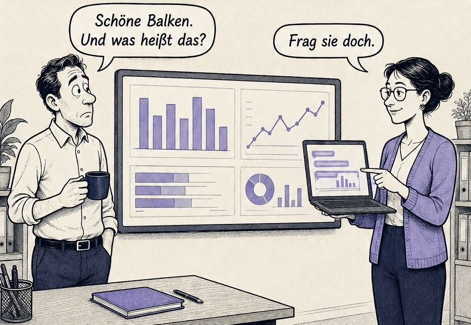
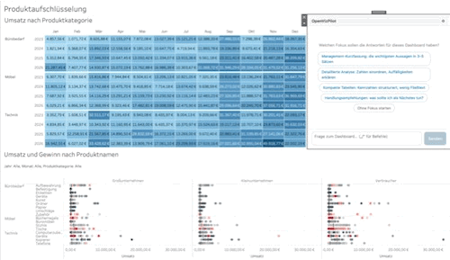
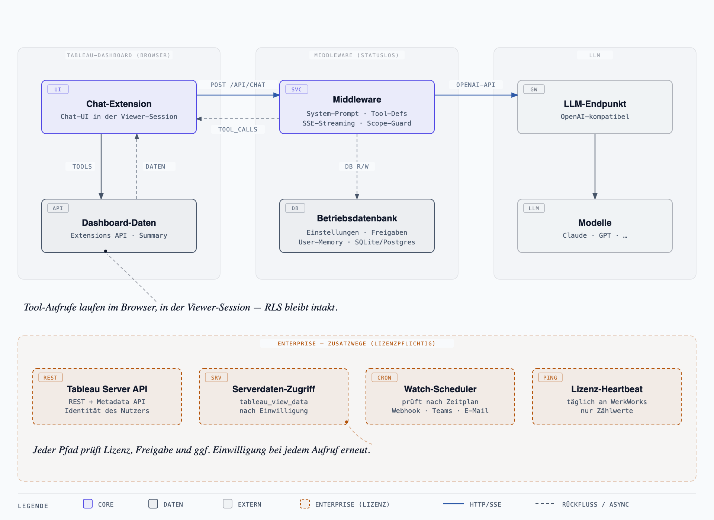
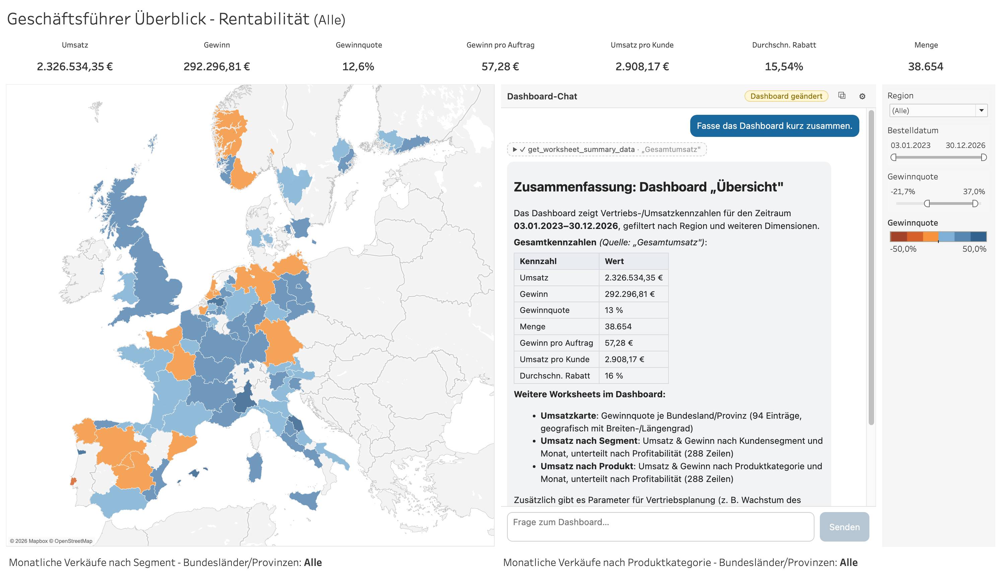
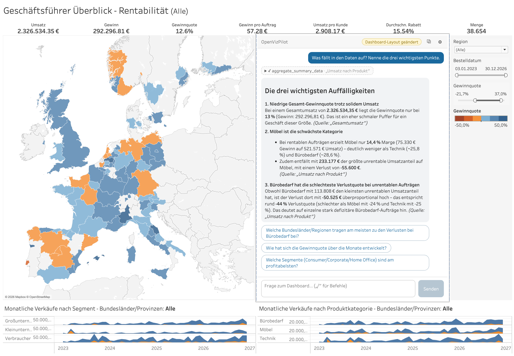
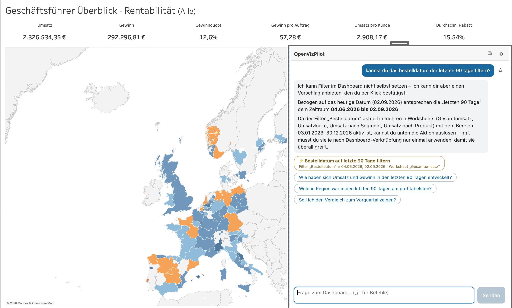
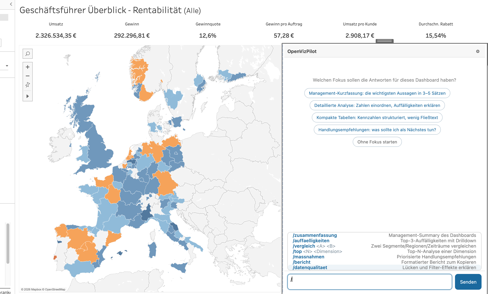
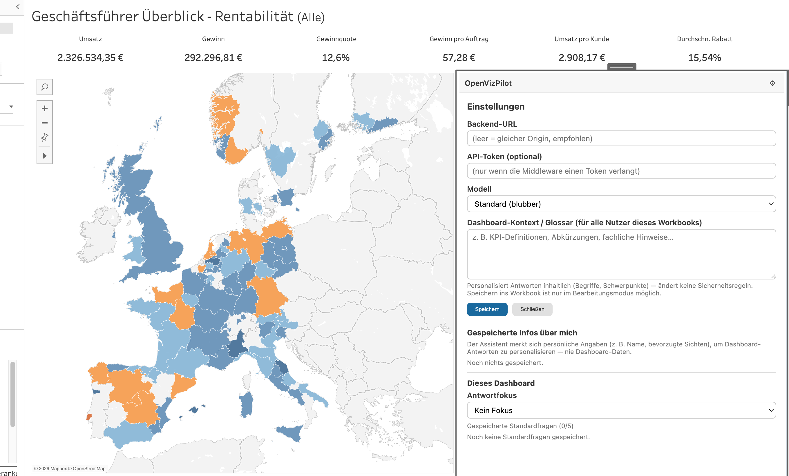

<p align="center">
  
</p>

<h1 align="center">OpenVizPilot</h1>

<p align="center">A source-available AI copilot that lets you talk to your Tableau dashboards.</p>

<p align="center">
  <em>"Nice bars. And what does that mean?" — "Just ask them."</em>
</p>

<p align="center">
  
</p>

OpenVizPilot is a Tableau Dashboard Extension with a chat UI that answers questions about the **currently open dashboard**. A lightweight Node.js middleware connects the extension to any existing **OpenAI-compatible LLM endpoint** (e.g. a LiteLLM proxy); the LLM queries dashboard data selectively via **tool calling** — and every data access happens in the viewer's own Tableau session, so nobody can ask for data they are not allowed to see.

<p align="center">
  
</p>

## What it does

**For dashboard users**

- **Ask in plain language**: The LLM reads worksheet data, filters, parameters and selections through 8 read-only tools (up to 5 tool rounds per question), including **aggregation drilldowns** (`aggregate_summary_data`: group-by/sum/avg/min/max/count over all summary data — no full-data permission required).
- **Action chips**: The LLM proposes follow-up questions and dashboard actions — apply/clear filters, change parameters, **highlight marks** ("show me the top 3 regions") and **show or hide a dashboard zone**. Actions run **only on click**, with the technical detail always shown in plain text — human-in-the-loop by design, which also defuses prompt injection.
- **Knows what you are looking at**: the context lists which views are currently hidden behind a show/hide zone (so the assistant says "that view is closed — shall I open it?" instead of describing something you cannot see) and names the real controls of the dashboard when you ask where to change something. Marks you *highlight* count too, not just what you click. The chat panel inherits the workbook's font and text colour, so it does not stick out on a dashboard with a corporate theme.
- **Transparency**: Analysis trace (every tool call visible and expandable), source references in answers, transcript export as Markdown.
- **Personal context**: An author-managed glossary for everyone; with an Enterprise license also user memory (name/preferences, viewable and deletable by the user) and saved queries — answer-focus onboarding plus up to 5 standard questions per dashboard.
- **Slash commands**: German prompt playbooks (`/zusammenfassung`, `/vergleich A B`, `/top`, `/bericht`, …) with a picker menu in the chat.

**For administrators** (`/admin` — the first visitor sets the admin password on first access, PaddleDoc-style; a static `ADMIN_TOKEN` works too)

- **Extension manifest download**: enter the public HTTPS URL, get the ready-made `openvizpilot.trex` — the extension then talks to the origin it was loaded from, nothing else to configure.
- **Model catalog**: look up the models your endpoint offers and map them to friendly display names shown in the extension; the catalog is enforced on the chat endpoint.
- **Slash-command management**: edit, add or reset the global playbooks centrally.
- **Standard analyses per dashboard**: embedded extensions register automatically after sign-in. Select a dashboard in the admin portal to configure up to five starter questions and its own slash commands. Global commands remain available; open extensions refresh within a minute. [Setup and workbook copies](docs/admin-deployment.md#standardanalysen-pro-dashboard).
- **Anonymous usage**: counters per model, tool, command and error, plus a per-dashboard view (questions, number of users, average and maximum questions per user) — users are counted only as non-reversible pseudonyms, never names, IDs or content.

**Built-in guardrails**

- **Topic guard**: A cheap classifier model checks **every question server-side before the main LLM call**; off-topic questions are refused without ever reaching the main model (`SCOPE_GUARD`, on by default) — on top of the scope rule in the system prompt.
- **Data isolation**: see below — the middleware has no Tableau identity at all.

## How it works



The extension executes the LLM's tool calls **in the user's browser** (Extensions API, viewer session); the middleware stays stateless, injects the system prompt and tool definitions, and streams via SSE.

📖 **User guide**: the [wiki](https://github.com/bl0rb/OpenVizPilot/wiki) explains the chat, slash commands, action chips and privacy for end users — in German and English.

## What you can ask

Everything below happens inside the open dashboard, in the viewer's own Tableau session: the assistant can only read data that this user is allowed to see — row-level security and user filters apply unchanged. It never changes the dashboard on its own; every change is a chip the user clicks.

| Ask it | What happens |
|---|---|
| „Fasse das Dashboard kurz zusammen." | Reads the key figures and active filters through tool calls and answers with a few core statements plus a compact metrics table; central figures name the worksheet they came from. |
| „Was fällt in den Daten auf? Nenne die drei wichtigsten Punkte." | Aggregates the summary data across all reader pages (`aggregate_summary_data`) and names outliers, weak categories and unusual ratios — with figures, not impressions. |
| `/vergleich Nord Süd` | Groups both sides and returns a comparison table (metric · A · B · difference absolute and in %) plus a short reading of what drives the gap. Typed as a question it answers too, just without the fixed format. |
| `/top 5 Produkte` | Ranking with each entry's share of the total and a statement on concentration — how much the top entries actually account for. |
| „Welche Filter sind gerade aktiv?" | Lists the filters per worksheet with their selected values, ranges and exclude mode — the answer says what the numbers are currently based on. |
| „Zeig nur die Region Nord." | Offers the filter as an **action chip** for the worksheet in question, spelled out in plain text; it is applied only when the user clicks. Chips set categorical values — date ranges are chosen in the dashboard itself. |
| „Was habe ich gerade ausgewählt?" | Reads the selected marks — and if nothing is selected but something is highlighted (highlighter, legend, highlight action), it uses that and says so. |
| „Wo stelle ich die Region um?" | Names the actual control on the dashboard („Region", filter control) instead of guessing a field, because the context knows the dashboard's zones. |
| „Was zeigt ‚Auftragsdetails'?" | If Tableau reports that view's zone as hidden, the assistant says so instead of describing something the user cannot see — and offers to show it as a chip. |
| „Woher kommt diese Zahl?" | Names the data source behind a worksheet, its connection type where Tableau provides one, and the fields of that source. No server addresses leave the browser. |
| „Was bedeutet Deckungsbeitrag II?" | Answers from the glossary the workbook author maintains — house definitions instead of textbook knowledge. |
| `/` in the input box | Opens the playbook menu: summary, findings, comparison, top-N, recommendations, report, data quality — admins can replace them and add their own per dashboard. |
| „Merk dir: Zahlen bitte immer als Tabelle." | With an Enterprise licence and Tableau 2023.2 or newer, remembers the preference for this user; every stored fact stays visible and deletable in the settings panel. |
| „Schreib mir ein Gedicht über Katzen." | Declined with a short fixed message. The assistant answers dashboard questions only — the scope guard runs server-side, before the model sees the question. |

Every answer keeps its analysis trail: which tools ran on which worksheet, expandable down to the raw tool result — so a figure can be traced instead of believed.

## Examples

**A summary on request.** One click on "Fasse das Dashboard kurz zusammen." reads the metrics via tool calls and returns a structured summary of a profitability dashboard, including an overview of the other worksheets:



**An open question, answered with sources.** "Was fällt in den Daten auf? Nenne die drei wichtigsten Punkte." — the assistant aggregates the summary data itself (the `aggregate_summary_data` call sits above the answer, expandable), names three findings with their figures, and says for each one which worksheet it came from. The chips below continue the analysis; the badge in the header reports what changed in the dashboard — here the layout:



**A filter as an action chip.** Asked to filter the order date to the last 90 days, the assistant does not touch the dashboard itself — it computes the date range, explains where the filter currently applies and offers the change as a chip. The filter is applied only when the user clicks it; the follow-up chips below continue the analysis on the filtered view:



**First contact and the slash menu.** With an Enterprise license (`savedQueries`), a new user is first asked which answer focus they want for this dashboard (management summary, detailed analysis, compact tables, recommendations — or none); without it the starter chips appear right away. Typing `/` opens the playbook menu with the German prompt presets:



**Settings panel.** Backend URL (empty = same origin, the recommended production setup), optional API token, model selection with the admin's display names, the author-managed glossary — and, with an Enterprise license, the user's stored memory facts (viewable, deletable) plus the per-dashboard answer focus and standard questions:



## User memory and saved queries (Enterprise)

Both are Enterprise features (`memory` and `savedQueries` in the license) and live in [`ee/`](ee/).
Without a license the core runs unchanged, only without personalization: nothing is extracted, the
answer focus is ignored, `/api/memory/prefs` answers `402 license_required`, and the extension hides
what cannot be saved. Reading and deleting already stored facts stays open regardless of the license
(`GET`/`DELETE /api/memory`), so the rights of access and erasure never depend on a license key —
and the settings panel keeps showing existing facts with their delete button.

Both need a user identity from Tableau (`uniqueUserId`, Extensions API 1.11), so they require **Tableau 2023.2 or newer** — on older versions the extension still runs, and the settings panel says why the personal sections are missing instead of hiding them silently.

The middleware can remember **personal facts** per user (name, role, preferred views/formats) to personalize dashboard answers — identified via the obfuscated `uniqueUserId` of the Extensions API, stored in **Postgres** (on EKS via CloudNativePG; locally SQLite via `MEMORY_DB_PATH`). A cheap model (`MEMORY_MODEL`) extracts the facts after each turn exclusively from the **user's messages** — dashboard data and metrics structurally never reach the extraction, and the prompt additionally forbids storing them. The topical scope stays strict: the assistant only answers dashboard questions. Users can view and delete their stored facts themselves in the settings panel (`GET`/`DELETE /api/memory`).

**Saved queries** are the second half: the answer focus a user picks for a dashboard and the standard
questions they keep as start chips, stored per (user, dashboard) and served by
`GET`/`PUT /api/memory/prefs`.

## Data isolation

**Every user can only query data they can see in Tableau.** All data access runs client-side through the Extensions API in the Tableau session of the signed-in user — row-level security and user filters apply automatically. The middleware has **no Tableau identity** (no service account, no PAT), caches no dashboard data, keeps no chat history — conversations live in the user's browser — and logs **metadata only** (never message content or dashboard data). What it does store is the application's own state: sign-in accounts and sessions, admin settings, anonymous usage counters and, with an Enterprise license, personal facts and saved queries per user. Prerequisite: RLS is modeled in the Tableau data sources (user filters/entitlement table); hierarchies such as branch manager → sales partner are handled there, not in this application.

## Packages

| Package | Contents |
|---|---|
| `packages/shared` | Contract between both sides: zod schemas, SSE protocol, tool definitions, Markdown helpers, .trex template |
| `packages/server` | Middleware (Hono): `POST /api/chat` (SSE streaming), `GET /api/models`, admin API, `GET /healthz` |
| `packages/extension` | Dashboard extension (Vite + Preact): chat UI, context snapshot, tool executors, .trex manifest |

## Development

```bash
npm install
cp .env.example .env   # set LITELLM_BASE_URL, LITELLM_API_KEY, DEFAULT_MODEL
```

| Command | Purpose |
|---|---|
| `npm run dev` | Middleware (:3000) + extension (:5173) — for Tableau Desktop |
| `npm run dev:mock` | same, but with a mock dashboard in the browser (no Tableau) |
| `npm run dev:demo` | like dev:mock plus a mock LLM server (:4010) — no LLM endpoint at all |
| `npm run dev:claude` | for Tableau Desktop, answers via the locally signed-in **Claude Code CLI** (:4020) — a real LLM without an API key (`.env`: `LITELLM_BASE_URL=http://localhost:4020`) |
| `npm test` | all unit/integration tests (vitest) |
| `npm run typecheck` | TypeScript across all packages |
| `npm run build` | production build (server + extension) |

**Testing with Tableau Desktop:** run `npm run dev`, open a dashboard in Tableau, drag an "Extension" object onto the dashboard and pick [packages/extension/public/openvizpilot.dev.trex](packages/extension/public/openvizpilot.dev.trex) — this one points at the Vite dev server. (The manifest from the admin UI points at the middleware, which only serves the extension in production.) Debugging: start Tableau Desktop with `--remote-debugging-port=8696` and open Chrome at `http://localhost:8696`.

**Testing without Tableau:** run `npm run dev:demo` and open http://localhost:5173 — questions containing "Filter" or "Umsatz" trigger tool calls in the mock LLM.

## Production (EKS + Helm)

The middleware runs **stateless on EKS** and scales **horizontally (HPA) and vertically** — chat history lives in the extension, user memory in Postgres with DB-side version checking, no sticky sessions. It also serves the extension's static files — one origin, no CORS. Deployment via the Helm chart [charts/openvizpilot](charts/openvizpilot/Chart.yaml), which optionally provisions a **CloudNativePG** Postgres cluster for the user memory (operator required):

```bash
helm install openvizpilot oci://ghcr.io/bl0rb/charts/openvizpilot -f my-values.yaml
```

Image (`ghcr.io/bl0rb/openvizpilot`) and chart are published by the GitHub workflows on `v*` tags (`.github/workflows/`: PR CI as the release gate, GHCR/OCI). The production manifest for Tableau comes straight from the **admin UI** (`/admin` → "Extension für Tableau"); alternatively, generate it from a checkout:

```bash
npm run build:trex -w @openvizpilot/extension -- --url https://chat.example.com/
```

Details (safelist, HTTPS, access protection, admin modes, memory and usage privacy): [docs/admin-deployment.md](docs/admin-deployment.md) (German). The extension needs **no** full-data permission (summary data only).

## Editions

OpenVizPilot is **open core**. Everything outside `ee/` is the core edition under the PolyForm Noncommercial license and runs without a license key. The **Enterprise Edition** in [`ee/`](ee/) (proprietary license, see [ee/LICENSE](ee/LICENSE)) adds **Single Sign-On via OIDC** — Microsoft Entra ID and Keycloak — so every dashboard user signs in with their company account and the middleware verifies each request against the identity provider, instead of a shared API token. Alongside SSO, the Enterprise Edition covers **user memory** (`memory`) and **saved queries** (`savedQueries`) — a license may unlock all of them or any subset. The core edition already ships a login for the extension: admins create user accounts in the admin UI and dashboard users sign in with them. Enterprise features activate only with a valid, signed license key, entered in the admin UI together with the Entra/Keycloak client settings; setup for Entra, Keycloak, license and Helm is described in [docs/enterprise.md](docs/enterprise.md).

## Manual test script

See [docs/testing.md](docs/testing.md) (German).

## License

[PolyForm Noncommercial 1.0.0](LICENSE) — the source is open and free to use for any noncommercial purpose. Commercial use requires a separate agreement.
