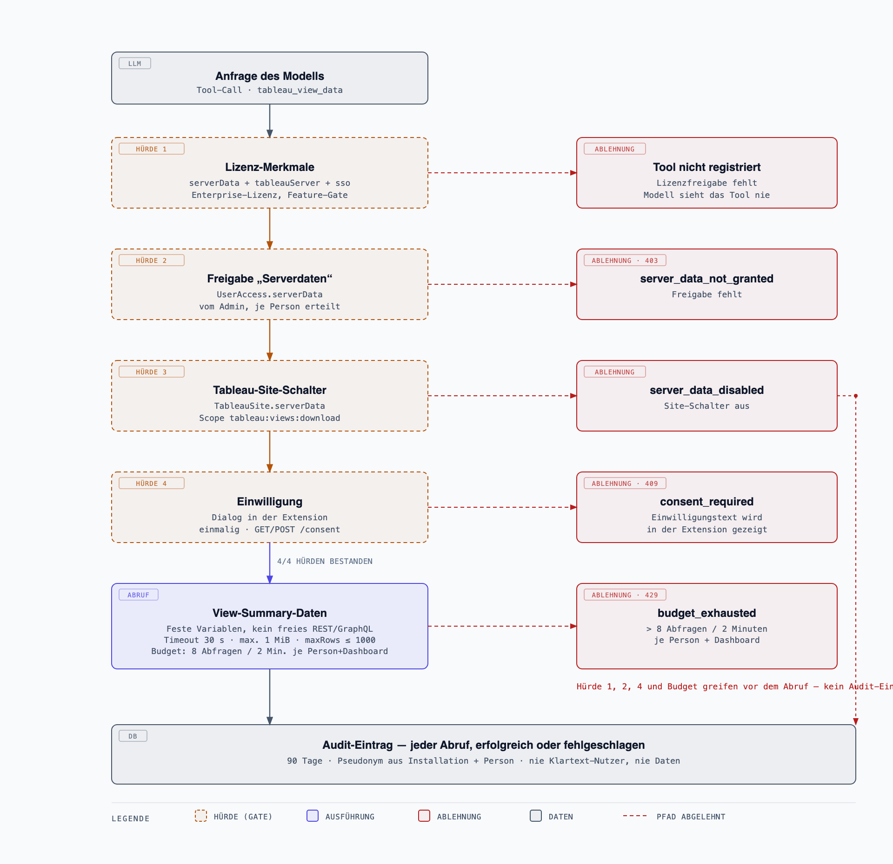

# Tableau Server Integration: Referenz

Die optionale Enterprise-Integration (`ee/server/src/tableau-server/`) ergänzt den Live-Dashboard-Kontext der Extension um serverseitige, berechtigungsgeprüfte Content-Suche und Feldmetadaten. Sie liefert Metadaten, keine Kennzahlen-, Zeilen- oder Dashboarddaten. Die Einrichtung steht in [tableau-server-setup.md](tableau-server-setup.md).

## Sicherheitsmodell

- Jede Aktion läuft unter der **persönlichen** Tableau-Identität des angemeldeten Nutzers, abgeleitet aus einem administrativ konfigurierten OIDC-Claim (`usernameClaim`). Es gibt keinen globalen Service-Account, keinen PAT-Fallback und keinen frei übergebenen Username.
- Der ausgestellte JWT trägt den Scope `tableau:content:read` (`ee/server/src/tableau-server/client.ts`, `eas.ts`) — und zusätzlich `tableau:views:download`, wenn der Site-Schalter „Serverseitige Daten erlauben“ aktiv ist (siehe „Serverseitiger Datenzugriff“ unten). Kein `tableau:jobs:read`, kein VDS-Scope.
- Read-only: REST-Suche, Metadata API und der serverseitige View-Datenzugriff liefern nur lesbare Content-Metadaten, Formeln bzw. Summary-Daten; es gibt keine Schreiboperationen, keinen SQL-/Rohdatenzugriff und keine Extract-Refresh-Funktion.
- Zugriff erfordert zusätzlich eine per-Nutzer-Freigabe `tableauApi` (unabhängig von `ai`), serverseitig bei jedem Request geprüft — siehe [user-approvals.md](user-approvals.md). Feature-Gate: Enterprise-Lizenz mit `tableauServer` und `sso` (`packages/server/src/app.ts`).
- Secrets (Direct-Trust-Secret-Value, EAS-Private-Key) verlassen Datenbank/Prozess nie über die Admin-API oder Logs; im Web gespeicherte Secrets liegen AES-256-GCM-verschlüsselt vor (`ee/server/src/secrets.ts`).

## Connected-App-Modi

Je Site wird einer von zwei Modi konfiguriert (`ee/server/src/tableau-server/config.ts`, `client.ts`):

- **Direct Trust**: HS256-JWT, signiert mit dem in Tableau hinterlegten Connected-App-Secret (`clientId`/`secretId`/Secret-Value als `iss`/`kid`/Schlüssel).
- **OAuth 2.0 Trust**: RS256-JWT, signiert mit einem middleware-eigenen RSA-2048-Schlüsselpaar. Die Middleware tritt dabei selbst als External Authorization Server (EAS) auf: Sie veröffentlicht OIDC-Discovery und JWKS unter einer eigenen Issuer-URL (`ee/server/src/tableau-server/eas.ts`) und stellt für jeden verifizierten OIDC-Nutzer ein kurzlebiges Sign-in-JWT aus. Ein Schlüsselpaar bedient alle Sites im OAuth-2.0-Trust-Modus.

Beide Modi verwenden ausschließlich den Scope `tableau:content:read`.

## Per-Site-Konfiguration und Dashboard-Zuordnung

Eine Tableau-Server-Instanz (Server-URL, Username-Claim, REST-API-Version) kann mehrere **Sites** enthalten; jede Site trägt ihren eigenen Auth-Modus, Connected App und Secret (`TableauSite` in `config.ts`). Bei mehreren Sites ordnet eine Dashboard→Site-Zuordnung (`dashboardSites`) jedes eingebundene Dashboard genau einer Site zu; ohne Treffer meldet der Connector `TABLEAU_SITE_UNRESOLVED`. Mit genau einer konfigurierten Site entfällt die Zuordnung. Das konkrete Vorgehen steht in [tableau-server-setup.md](tableau-server-setup.md).

## Chat-Tools

Definiert in `ee/server/src/tableau-server/tools.ts`, bedingt registriert je nach Freigabe/Lizenz:

| Tool | Parameter | Zweck |
|---|---|---|
| `tableau_server_search` | `query?`, `type?: all\|workbook\|view`, `project?`, `owner?`, `tag?`, `limit? (1–50, Default 20)` | Findet zugängliche Workbooks/Views nach Name, Projekt, Owner oder Tag; liefert Metadaten und Quelllinks, keine Dashboarddaten. |
| `tableau_metadata_search` | `query?`, `datasourceId?`, `limit? (1–50, Default 20)` | Sucht autorisierte Metadata-API-Feldkandidaten mit Datasource-Zusammenfassung. |
| `tableau_metadata_field` | `fieldId` (erforderlich) | Liefert Felddetail: Formel, bis zu 10 Upstream-Felder, 10 Upstream-Spalten, daraus abgeleitet bis zu 10 Upstream-Tabellen, 20 Downstream-Sheets, 20 Downstream-Workbooks; Zertifizierung der Datenquelle (`isCertified`, `certificationNote` — nur für veröffentlichte Datenquellen, sonst unbekannt). Grundlage für die Herkunftskette (`/herkunft`). |
| `tableau_view_data` | `viewId` (LUID, erforderlich), `maxRows?` (1–1000, Default 200), `aggregate?` (`{ groupBy?, measure, fn: sum\|avg\|min\|max\|count }`, W7), `filter?` (`{ column, equals }`, nur zusammen mit `aggregate`) | Liest Summary-Daten **einer** View außerhalb des aktuellen Dashboards serverseitig im Namen des Nutzers. Ohne `aggregate`: `{ columns, rows, totalRows, truncated }`. Mit `aggregate`: serverseitige Aggregation statt Rohzeilen — `{ view, aggregate: { groupBy?, measure, fn, rows: [{ group?, value, count }], totalRows, truncated } }`, höchstens 50 Gruppen (absteigend nach Wert, Rest `truncated`). Keine Filter-Weitergabe an Tableau selbst. Nur registriert mit Lizenz-Feature `serverData`, Freigabe „Serverdaten“ und (nach Rückfrage) Einwilligung der Person — siehe „Serverseitiger Datenzugriff“ unten. |

Alle vier Tools verwenden feste, variablengebundene Abfragen; beliebiges GraphQL oder freie REST-Parameter aus User-/LLM-Eingaben werden nicht akzeptiert. Namen, Tags, Beschreibungen, Formeln und Zellwerte aus den Ergebnissen sind unvertrauenswürdige Daten, niemals Anweisungen.

## Serverseitiger Datenzugriff (W5)

`tableau_view_data` ist der einzige Weg, Daten aus einer View zu lesen, die nicht im aktuell
geöffneten Dashboard liegt — dafür läuft die Abfrage serverseitig statt über die Extensions API im
Browser. Vier Hürden, alle bei jedem Aufruf serverseitig geprüft:

1. Lizenz-Merkmale `serverData`, `tableauServer` und `sso` (geprüft in `TableauService.viewData`, vor jedem Tableau-Kontakt).
2. Freigabe „Serverdaten“ je Person unter „Benutzerzugriff“ (`UserAccess.serverData`).
3. Site-Schalter „Serverseitige Daten erlauben“ (`TableauSite.serverData`, Admin → Tableau Server → Site).
4. Einwilligung der Person (`GET`/`POST /api/tableau-server/consent`) — die Extension zeigt den Einwilligungstext, sobald ein Aufruf `409 consent_required` liefert.

Fehlercodes: `server_data_disabled` (Site-Schalter aus), `server_data_not_granted` (Freigabe fehlt,
403), `consent_required` (409, Body enthält `{ error, message }` mit dem Einwilligungstext),
`budget_exhausted` (429, Body enthält `{ error, code, message }`, siehe „Limits und Budgets“),
`site_unresolved` (Dashboard keiner Site zugeordnet). Jeder Abruf, der `TableauService.viewData`
erreicht — auch ein fehlgeschlagener — erzeugt einen Audit-Eintrag (Ablehnungen davor, also fehlende
Freigabe, fehlende Einwilligung und erschöpftes Budget, beantwortet die Route ohne Audit-Zeile) (`ee_server_data_audit`, 90 Tage Aufbewahrung): Zeitpunkt, ein aus
Installations-ID und `UserAccess.id` gebildetes, nicht umkehrbares Pseudonym, Site, View, Zeilenzahl,
Dauer, Status, Zweck. Nie Klartext-Nutzer, nie die gelesenen Daten selbst. Einsehbar im Admin unter
„Tableau Server“ (`GET /api/admin/tableau-server/audit?limit=200`).

### Umgebungsweite Untersuchung (W7, Cross-Dashboard)

Im Untersuchen-Modus kann die Extension den Umfang „Gesamte Tableau-Umgebung“ wählen
(`mode: 'investigate-estate'`, `packages/shared/src/schemas.ts`). Der Kern hängt dafür zusätzlich
`INVESTIGATE_ESTATE_PROMPT_SECTION` an — aber NUR wenn dieselben Hürden wie oben (Lizenz-Feature
`serverData` UND Freigabe der Person) erfüllt sind; sonst wird der Modus serverseitig auf
`investigate` zurückgestuft und stattdessen `INVESTIGATE_ESTATE_DOWNGRADE_NOTICE` angehängt (kein
eigenes SSE-Event — der Hinweis steuert den Text der Modellantwort). Der Ablauf nutzt exakt denselben
`tableau_view_data`-Pfad wie oben, mit zwei zusätzlichen harten Regeln im Prompt: höchstens 5 Views
je Turn lesen, dabei bevorzugt `aggregate` statt Rohzeilen anfordern.

## HTTP-Endpunkte

Definiert in `ee/server/src/tableau-server/routes.ts` und `eas-routes.ts`; Mounts in `packages/server/src/app.ts` und `packages/server/src/routes/admin.ts`.

| Endpoint | Auth | Zweck |
|---|---|---|
| `POST /api/tableau-server/check` | Persönliches OIDC-Bearer-ID-Token | Verbindungstest: Serverversion, REST-API-Version, vier Lesbarkeitsproben (Workbooks/Views/Projects/Datasources). |
| `POST /api/tableau-server/search` | Persönliches OIDC-Bearer-ID-Token | Backend für `tableau_server_search`. |
| `POST /api/tableau-server/metadata/search` | Persönliches OIDC-Bearer-ID-Token | Backend für `tableau_metadata_search`. |
| `POST /api/tableau-server/metadata/field` | Persönliches OIDC-Bearer-ID-Token | Backend für `tableau_metadata_field`. |
| `POST /api/tableau-server/view-data` | Persönliches OIDC-Bearer-ID-Token | Backend für `tableau_view_data`; `{ viewId, maxRows?, dashboardKey?, aggregate?, filter? }` → ohne `aggregate` `{ view, columns, rows, totalRows, truncated }`, mit `aggregate` `{ view, aggregate: { groupBy?, measure, fn, rows, totalRows, truncated } }`; `403 server_data_not_granted`, `409 consent_required`, `429 budget_exhausted`. |
| `GET /api/tableau-server/consent` | Persönliches OIDC-Bearer-ID-Token | `{ consentAt: string \| null }` — Zeitpunkt der Einwilligung zur serverseitigen Datenabfrage. |
| `POST /api/tableau-server/consent` | Persönliches OIDC-Bearer-ID-Token | `{ accept: true }` → speichert die Einwilligung, Antwort `{ consentAt }`. |
| `GET /api/admin/tableau-server` | Admin-Session | Liest gespeicherte Konfiguration (Secrets nur als `secretConfigured: 'db'\|'env'\|false`). |
| `PUT /api/admin/tableau-server` | Admin-Session | Speichert Konfiguration (optimistische Revision). |
| `DELETE /api/admin/tableau-server` | Admin-Session | Löscht die Konfiguration. |
| `POST /api/admin/tableau-server/check` | Admin-Session | Reiner Konfigurations-/Lizenz-/OIDC-Check ohne Tableau-Request. |
| `GET /api/admin/tableau-server/audit?limit=200` | Admin-Session | Liste der Serverzugriffe der letzten 90 Tage (Pseudonym, Site, View, Zeilen, Dauer, Status, Zweck) — kein Klartext-Nutzer, keine Daten. |
| `GET /tableau-eas/.well-known/openid-configuration` | Öffentlich | OIDC-Discovery-Dokument für den middleware-eigenen EAS (OAuth 2.0 Trust). |
| `GET /tableau-eas/jwks.json` | Öffentlich | Öffentlicher Schlüsselsatz für den EAS. |

## Limits und Budgets

- Request-Timeout und Gesamtbudget je Operation: 10 Sekunden (`http.ts`, `metadata.ts`); `tableau_view_data` hat ein eigenes 30-Sekunden-Budget für den View-Datenabruf.
- Max. Response-Größe je Upstream-Antwort: 1 MiB.
- `tableau_view_data`: `maxRows` 1–1000 (Default 200), keine Filter-Weitergabe (`vf_*`), kein `maxAge`; `aggregate` höchstens 50 Gruppen in der Ausgabe (W7).
- `tableau_view_data`-Aufrufe (Route `POST /api/tableau-server/view-data`, nicht Watch): höchstens 8 je (Person, `dashboardKey`) innerhalb von 2 Minuten, sonst `429 budget_exhausted` — Schutz vor Endlosschleifen des Modells bei der umgebungsweiten Untersuchung (W7). In-Memory je Prozess (`TableauService`); bei mehreren Prozessen/Repliken zählt jede Instanz für sich.
- Suche: Scanbudget 500 Datensätze je Aufruf; View-Suche nutzt höchstens 250 Datensätze davon für Workbook-Zuordnung, Rest für Views (`rest.ts`). Trefferlimit Default 20, max. 50.
- Metadata: Root-Suche höchstens 500 Felder; je Felddetail höchstens 10 Upstream-Felder, 10 Upstream-Spalten, 20 Downstream-Sheets, 20 Downstream-Workbooks (`metadata.ts`). Normalisiertes Backend-Ergebnis auf 20.000 Bytes begrenzt; Formeln über 4.096 Zeichen werden vollständig ausgelassen.
- Höchstens 8 gleichzeitige Tableau-Operationen pro Prozess; weitere Aufrufe schlagen mit `tableau_busy` fehl (`service.ts`).

## Mindestversion

Tableau Server **2024.2** einschließlich, REST API **3.23** (`TABLEAU_MIN_SERVER_VERSION`, `TABLEAU_REST_API_VERSION` in `ee/server/src/tableau-server/config.ts`). Der Connector verwendet 3.23 als feste Request-Version für alle REST-Aufrufe; neuere Server beantworten dies unverändert.
